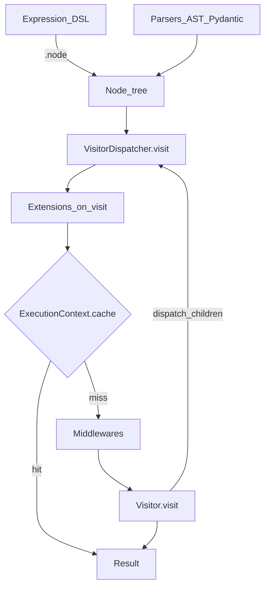

# Architecture

**Dynamic-expressions** separate what an expression is (nodes) from the way it is evaluated (visitors). A dispatcher connects these two aspects and provides hooks for caching, middleware, and serialization.

## Core model

## Building expressions

There are three common ways to obtain a node tree:

| Approach | When to use |
|----------|-------------|
| [Context DSL](context-dsl.md) | Rules authored in Python with type-safe field access |
| [AST parser](../serialization/ast.md) | Rules stored as strings in config or a database |
| [Pydantic schemas](../serialization/pydantic.md) | Rules exchanged as JSON over an API or retrieved from the database |

All paths produce the same immutable `Node` trees evaluated by the dispatcher.

## Evaluation pipeline

When you call `await dispatcher.visit(node, context)`:

1. **Extensions** — each registered `OnVisitExtension` enters an async context manager for the current node. Cache extensions may populate `ExecutionContext.cache` before the visitor runs.
2. **Per-call cache** — if the node was already evaluated in this `visit` call, return the memoized result.
3. **Middlewares** — optional chain that wraps the visitor (logging, timing, etc).
4. **Visitor** — evaluates the node. Composite nodes call `dispatch(child, context)` to evaluate children recursively.
5. **Store result** — the return value is cached in `ExecutionContext` for the remainder of the call.

## Context

**Context** is runtime input data — a dataclass instance, a Pydantic model, or any object with attributes. [FromContextNode](nodes.md#from-context) reads fields from it during evaluation.

**ExecutionContext** is internal per-call state (currently a node→result cache). Extensions may read or pre-populate it.

## Serialization and caching

- [Serialization](../serialization/index.md) converts node trees to/from bytes or JSON for storage and transport.
- [Cache extensions](../extending/extensions.md) persist evaluation results in Redis (or a custom backend) across requests.

## Next steps

- [Getting started](../getting-started.md) — minimal working example
- [Nodes reference](nodes.md) — all built-in node types
- [Cookbook](../cookbook/index.md) — end-to-end recipes
