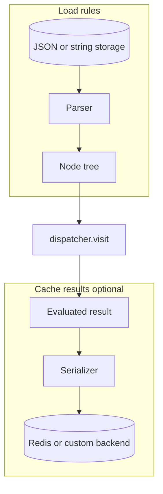

# Serialization

The `dynamic_expressions.serialization` package covers **two separate jobs**:

| Role | Direction | Purpose |
|------|-----------|---------|
| **Parser** | stored rule → [Node](../concepts/nodes.md) tree | Load expressions from JSON or a string before evaluation |
| **Serializer** | Python value ↔ `bytes` | Persist **evaluation results** in [cache extensions](../advanced/extensions/cache.md) |

Parsers are format-specific (no shared protocol). Serializers implement a common [`Serializer`](#serializer-protocol) protocol. Every parser produces the same immutable `Node` trees evaluated by the [dispatcher](../concepts/dispatcher.md).

## Parsers

Turn external rule formats into runtime nodes.

| Format | Parser | Module | Guide |
|--------|--------|--------|-------|
| JSON (discriminated schemas) | [`PydanticExpressionParser`](pydantic.md#pydanticexpressionparser) + `NodeSchema.to_node()` | `dynamic_expressions.serialization.pydantic` | [Pydantic](pydantic.md) |
| Python-like string | [`ExpressionEvalParser.parse()`](ast.md#expressionevalparser) | `dynamic_expressions.serialization.ast` | [AST](ast.md) |

```python
# Pydantic — JSON from an API or database
from dynamic_expressions.serialization.pydantic import BUILTIN_SCHEMAS, PydanticExpressionParser

parser = PydanticExpressionParser(BUILTIN_SCHEMAS)
schema = parser.type_adapter.validate_json(
'''{
    "type": "binary",
    "operator": "+",
    "left": { "type": "literal", "value": 2 },
    "right": { "type": "literal", "value": 2 }
}''')
node = schema.to_node()

# AST — human-readable rule string
from dynamic_expressions.serialization.ast import ExpressionEvalParser, get_builtin_handlers

node = ExpressionEvalParser(handlers=get_builtin_handlers()).parse("2 + 2")
```


## Serializer protocol

Serializers encode **cached evaluation results**, not expression trees.

::: dynamic_expressions.serialization.Serializer

```python
class Serializer[TResult](Protocol):
    def serialize(self, value: TResult) -> bytes: ...
    def deserialize(self, value: bytes) -> TResult: ...
```

| Implementation | Module | Typical use |
|----------------|--------|-------------|
| [`MsgSpecScalarSerializer`](msgspec.md#msgspecscalarserializer) | `dynamic_expressions.serialization.msgspec` | Default for Redis cache — JSON-compatible scalars |
| [`MsgSpecSerializer`](msgspec.md#msgspecserializer) | `dynamic_expressions.serialization.msgspec` | Typed msgspec structs in cache |
| [`PydanticSerializer`](pydantic.md#pydanticserializer) | `dynamic_expressions.serialization.pydantic` | Typed values with Pydantic validation on read |

The [Pydantic](pydantic.md) module is the only one that provides **both** a parser and serializers; [MsgSpec](msgspec.md) covers serializers only; [AST](ast.md) covers parsers only.

## Typical workflow



1. **Parse** — use a [parser](#parsers) to build a `Node` tree from stored rules.
2. **Evaluate** — run `dispatcher.visit(node, context)`.
3. **Serialize results** — pass a `Serializer` to a [cache extension](../advanced/extensions/cache.md) to persist evaluation outputs across requests.

## Optional dependencies

```bash
pip install dynamic-expressions[serialization-pydantic]   # parsers + PydanticSerializer
pip install dynamic-expressions[serialization-msgspec]    # MsgSpec serializers
pip install dynamic-expressions[cache-redis,serialization-msgspec]
```

See individual format pages and the [cookbook](../cookbook/index.md) for end-to-end examples.
