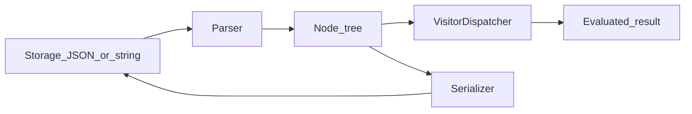

# Serialization

Dynamic-expressions supports multiple formats for storing and transporting expression trees. All serializers implement a common protocol.

## Serializer protocol

::: dynamic_expressions.serialization.Serializer

```python
class Serializer[TResult](Protocol):
    def serialize(self, value: TResult) -> bytes: ...
    def deserialize(self, value: bytes) -> TResult: ...
```

Serializers are used by [cache extensions](../extending/extensions.md) to persist evaluation results. The built-in `MsgSpecScalarSerializer` handles JSON-compatible scalars.

## Approaches

| Format | Module | Best for |
|--------|--------|----------|
| [Pydantic JSON](pydantic.md) | `dynamic_expressions.serialization.pydantic` | Expression JSON via schemas; typed values via `PydanticSerializer` |
| [AST strings](ast.md) | `dynamic_expressions.serialization.ast` | Human-readable rules in python-like string |
| [MsgSpec](msgspec.md) | `dynamic_expressions.serialization.msgspec` | Fast binary/JSON cache values |

All parsers produce standard [Node](../concepts/nodes.md) trees that work with the same dispatcher and visitors.

## Typical workflow



1. **Deserialize** — parse stored data into nodes.
2. **Evaluate** — run `dispatcher.visit(node, context)`.
3. **Serialize** — optionally round-trip nodes back to storage (Pydantic schemas support `dump_python` / `validate_json`).

## Optional dependencies

```bash
pip install dynamic-expressions[serialization-pydantic]
pip install dynamic-expressions[serialization-msgspec]
pip install dynamic-expressions[cache-redis,serialization-msgspec]
```

See individual format pages for details and cookbook examples.
